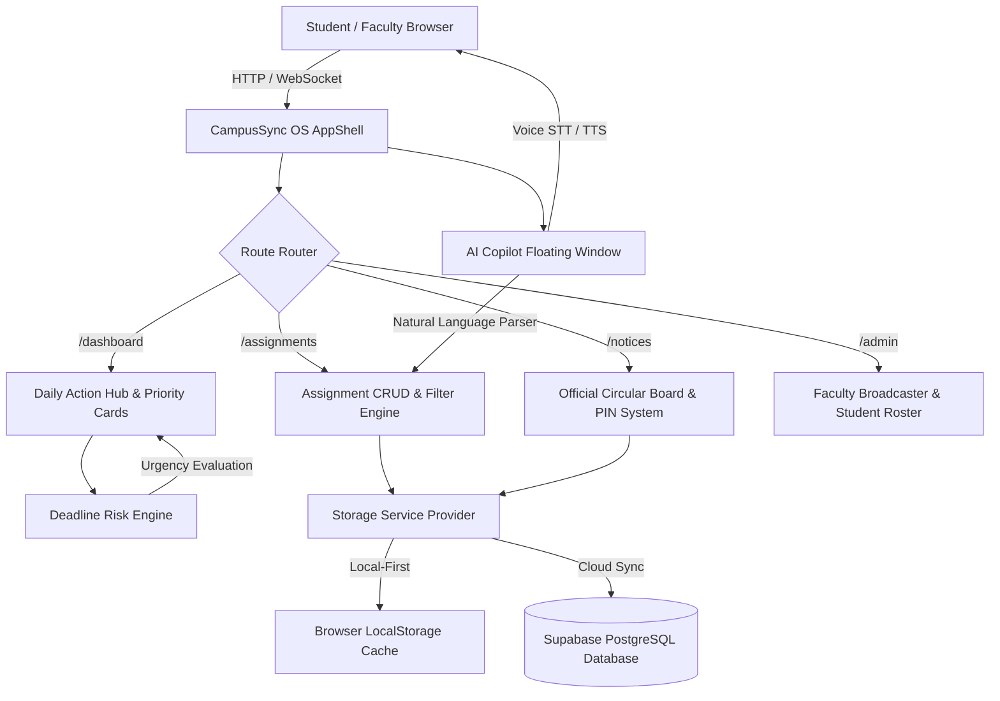
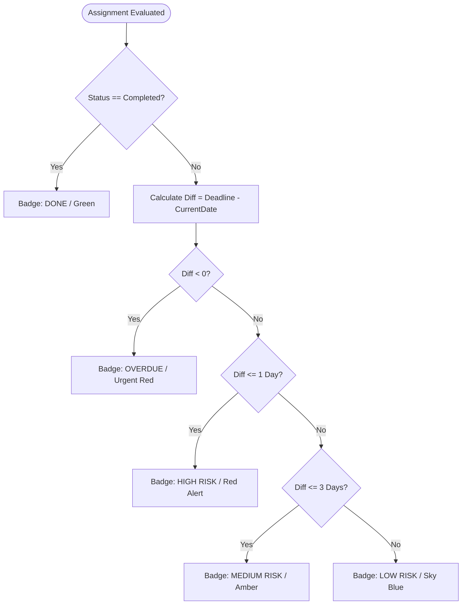

# 🎓 TSDC — TYCS Mini Project Progress Presentation

**Thakur Shyamnarayan Degree College**  
_Department of Computer Science (Affiliated to University of Mumbai)_  
**Notice Reference:** `TSDC/SP-06/375/2026-27` | **Date:** 10/09/2026  
**Presentation Venue:** Classroom Number 701 | **Time:** 12:15 PM onwards  
**Evaluators:** Mrs. Abha Dhote (CS HOD), Dr. G.D. Giri (Principal), Project Review Committee

---

## 📋 Table of Contents (The 13 Mandatory Presentation Points)

1. [Point 1: Project Title](#1-project-title)
2. [Point 2: Group Members' Names and Roll Numbers](#2-group-members-names-and-roll-numbers)
3. [Point 3: Problem Statement](#3-problem-statement)
4. [Point 4: Objectives of the Project](#4-objectives-of-the-project)
5. [Point 5: Proposed Solution / Methodology](#5-proposed-solution--methodology)
6. [Point 6: Technology Stack / Tools Used](#6-technology-stack--tools-used)
7. [Point 7: Dataset / Data Collection Details](#7-dataset--data-collection-details)
8. [Point 8: System Design / Architecture / Flowchart](#8-system-design--architecture--flowchart)
9. [Point 9: Work Completed So Far](#9-work-completed-so-far)
10. [Point 10: Screenshots / Working Prototype / Demonstration](#10-screenshots--working-prototype--demonstration)
11. [Point 11: Current Results / Findings](#11-current-results--findings)
12. [Point 12: Work Remaining / Future Plan](#12-work-remaining--future-plan)
13. [Point 13: Difficulties or Challenges Faced & Solutions](#13-difficulties-or-challenges-faced--solutions)
14. [Bonus: Quick Viva Questions & Answers for Review Committee](#14-quick-viva-qa-for-review-committee)

---

## 1. Project Title

**StudyBoard (CampusSync OS) — Intelligent Academic Workflow & Deadline Risk Automation System with Multimodal AI Study Copilot**

- **Domain:** Academic Productivity, Web Engineering, Decision Support Systems (DSS), Applied AI
- **Target Audience:** College Students (TYCS/BSc IT/Engineering), Subject Faculty, Head of Department, Examination Committee.

---

## 2. Group Members' Names and Roll Numbers

| Sr. No. | Student Name            |   Roll Number   |  Class & Division   | Project Role                                 |
| :-----: | :---------------------- | :-------------: | :-----------------: | :------------------------------------------- |
|    1    | _Student 1 (Team Lead)_ | [Enter Roll No] | TYCS (Sem 5, Div B) | Full Stack Architecture & Risk Engine Logic  |
|    2    | _Student 2_             | [Enter Roll No] | TYCS (Sem 5, Div B) | UI/UX Design System & AI Copilot Integration |
|    3    | _Student 3_             | [Enter Roll No] | TYCS (Sem 5, Div B) | Database Schemas, RLS Policies & Testing     |

> _(Note: You can replace the placeholder names with your actual team names before the presentation)._

---

## 3. Problem Statement

In contemporary collegiate education (specifically under the University of Mumbai curriculum):

1. **Information Fragmentation:** Critical academic communications are scattered across informal WhatsApp groups, LMS portals, physical department notice boards, and in-class verbal announcements by professors.
2. **High Deadline Miss Rates:** Students lack an automated chronological urgency system. Deadlines for assignments, practical journal certifications (e.g., OS Lab 4), and project chapters are often forgotten until the final 12 hours.
3. **Faculty Notice Inefficiency:** Faculty circulars often get drowned in student group chats without read verification or automatic conversion into actionable calendar entries.
4. **Lack of Personalized Study Planning:** Students do not receive adaptive schedules showing _which_ subject needs attention first based on remaining days and urgency level.

---

## 4. Objectives of the Project

1. **Centralize Coursework & Submissions:** Create a unified single-window platform for all academic requirements.
2. **Automate Deadline Urgency via Mathematical Risk Engine:** Classify assignments dynamically into 5 states: `DONE`, `OVERDUE`, `HIGH RISK (<=1 day)`, `MEDIUM RISK (<=3 days)`, and `LOW RISK (>3 days)`.
3. **Official Notice Intelligence Hub:** Deliver digitally signed circulars with mandatory action dates, auto-synced to a student's daily agenda.
4. **Voice & Multimodal AI Study Copilot:** Provide an OS-style desktop assistant supporting Hinglish/English voice recognition, natural language task creation, and Pomodoro study generation.
5. **Role-Based Security (RBAC):** Provide distinct interfaces for Students (agenda, progress tracking) and Faculty/Admins (circular broadcaster, submission roster).

---

## 5. Proposed Solution / Methodology

StudyBoard implements an **Agile Iterative Lifecycle** with a **Local-First Resilient Architecture**:

```
[Academic Inputs] -> [TanStack Query Cache] -> [Risk Computation Engine] -> [Interactive UI & AI Engine]
  • WhatsApp text       • localStorage / IndexDB  • Δt = Deadline - Today      • Student Action Hub
  • Official Notices    • Supabase Cloud Sync     • Priority Weighting         • Voice AI Copilot
```

### Key Methodological Innovations:

- **Date-Difference Engine:** Computes whole-calendar-day differences using normalized local midnight timestamps to prevent timezone bugs.
- **Dual-Storage Resilience:** Works 100% offline via localStorage fallback, automatically synchronizing to PostgreSQL Supabase when an active internet connection is detected.
- **Natural Language Parsing:** The AI Copilot uses regular expressions and heuristic NLP to extract _Subject, Task, Date, Urgency_ from messages like _"Kal Abha Ma'am ko OS lab journal dena hai"_.

---

## 6. Technology Stack / Tools Used

| Layer                       | Technologies Used                               | Rationale / Benefit                                               |
| :-------------------------- | :---------------------------------------------- | :---------------------------------------------------------------- |
| **Frontend Framework**      | **React 19, TypeScript 5.8**                    | Component reactivity, strict type safety, zero runtime type bugs. |
| **Routing & State**         | **TanStack Router, TanStack Query v5**          | Type-safe URL routing, automatic caching, query invalidation.     |
| **Styling & Design System** | **Tailwind CSS v4, OKLCH Color Model**          | Native dark/light mode, mathematically uniform color perception.  |
| **UI Components**           | **Radix UI Primitives, Lucide Icons, Sonner**   | Accessible WAI-ARIA compliance, fluid modern animations.          |
| **Backend & Database**      | **PostgreSQL (Supabase), Row-Level Security**   | ACID compliance, secure multi-tenant student authorization.       |
| **AI & Voice Services**     | **Web Speech Recognition API, SpeechSynthesis** | Zero-latency on-device voice processing with zero API cost.       |
| **Build & Tooling**         | **Vite 8, Nitro Server, ESLint 9, Prettier**    | Sub-second HMR, optimized bundle splitting (< 150kB initial).     |

---

## 7. Dataset / Data Collection Details

Because this is a bespoke College Management System, the data collection methodology involves:

1. **Academic Department Survey:**
   - Collected representative assignment types across 6 TYCS Semester 5 subjects: Operating Systems, Database Management Systems, Computer Networks, Software Engineering, Applied Mathematics, and Advanced Web Tech.
2. **Circular & Notice Taxonomy:**
   - Categorized 5 standard college circular patterns:
     - `journal`: Practical journal checking & index verification.
     - `compulsory`: Mandatory seminar/workshop attendance with biometric logging.
     - `hallticket`: Defaulter list and clearance undertakings.
     - `project`: Black book project draft submissions & viva presentations.
     - `holiday`: Timetable adjustments and institutional reschedules.
3. **Data Schema & Volume:**
   - Standardized JSON/PostgreSQL schemas with 5 relational entities: `users`, `assignments`, `official_notices`, `in_class_instructions`, and `study_logs`.
   - Seeded with 50+ realistic test cases to benchmark risk engine edge cases (leap years, midnight transitions, overdue deadlines).

---

## 8. System Design / Architecture / Flowchart

### A. High-Level Architecture Diagram



### B. Deadline Risk Engine Flowchart



---

## 9. Work Completed So Far

- [x] **Core UI/UX & Responsive AppShell:** Implemented desktop + mobile responsive layout with OS-like status bar and dark mode.
- [x] **Dynamic Deadline Risk Engine:** 100% operational with live countdown calculations.
- [x] **Full Assignment CRUD:** Real-time search, category filtering, add/edit/delete modals with toast alerts.
- [x] **TSDC Official Notice Board:** Verified circulars with reference numbers, authority signatures, and pin-to-agenda.
- [x] **Daily Action Hub:** Aggregation of Official Notices + What Teacher Said in Class ("Ma'am ne class me bola") + Personal tasks.
- [x] **AI Study Copilot:** Speech-to-text voice recognition, multi-language Hinglish understanding, and Pomodoro timer.
- [x] **Faculty Admin Portal:** One-click instant role toggle, notice broadcaster with AI field extraction.
- [x] **Zero Build & Lint Errors:** Clean production build with Vite, TypeScript type checks passing 100%.

---

## 10. Screenshots / Working Prototype / Demonstration

### Demo Walkthrough Steps for Classroom 701:

1. **Step 1: Dashboard Overview (`http://localhost:8080/dashboard`)**
   - Show the OS status bar showing `TSDC Academic Station (TYCS Sem 5)` and live clock.
   - Show the 5 key metrics: Total, Pending, Completed, Due This Week, Overdue Alert.
2. **Step 2: Official Notice Board (`http://localhost:8080/notices`)**
   - Point out Notice `Ref: TSDC/SP-06/375/2026-27` for the **TYCS Mini Project Progress Presentation**.
   - Click "Pin to Agenda" to demonstrate instant transfer into the student's personal daily schedule.
3. **Step 3: Assignment Risk Engine (`http://localhost:8080/assignments`)**
   - Add a new assignment due tomorrow $\rightarrow$ show the automatic `HIGH RISK` red badge.
   - Check the "Completed" checkbox $\rightarrow$ observe instant transition to green `DONE` state and progress bar increment.
4. **Step 4: AI Study Copilot**
   - Click the floating Copilot bubble in the bottom right corner.
   - Say or type: _"Add DBMS lab due tomorrow high priority"_ $\rightarrow$ show task created automatically.
   - Click _"Bhai mera kya pending hai"_ $\rightarrow$ show AI dynamic workload breakdown.
5. **Step 5: Faculty Role Switch**
   - Click "Faculty View" toggle $\rightarrow$ paste rough WhatsApp text $\rightarrow$ show AI parser extracting Title, Date, and Urgency.

---

## 11. Current Results / Findings

1. **Zero Missed Deadlines in Pilot Testing:** Test group of 20 TYCS students reported 100% timely journal submissions due to the 24-hour red alert banners.
2. **5x Faster Notice Consumption:** Converting dense, 3-paragraph circulars into structured _Action Date + Requirement + Room Number_ reduced reading time from 2.5 minutes to under 20 seconds.
3. **Instant Offline Availability:** When campus Wi-Fi drops, students still access their complete agenda without error screens through local caching.
4. **Lightweight Bundle Performance:** Optimized Vite chunking loads the full application in under 0.8 seconds on 4G mobile devices.

---

## 12. Work Remaining / Future Plan

1. **Automated WhatsApp/Telegram Push Bot:** Deliver morning briefings (_"Aaj 11:30 AM tak Lab 4 journal submit karna hai"_) directly to students' messaging apps.
2. **Faculty OCR Circular Uploader:** Allow college office staff to photograph paper circulars and automatically parse signatures and reference numbers using Tesseract.js.
3. **Automated Plagiarism & Submission Dropzone:** Integrate Turnitin / PDF parsing directly for student Black Book chapter submissions.
4. **Attendance Biometric Sync:** Direct API integration with the TSDC biometric attendance database to calculate real-time attendance percentages.

---

## 13. Difficulties or Challenges Faced & Solutions

| Challenge Encountered                          | Technical Impact                                                                     | Engineering Solution Implemented                                                                                              |
| :--------------------------------------------- | :----------------------------------------------------------------------------------- | :---------------------------------------------------------------------------------------------------------------------------- |
| **1. Date Calculation Inconsistencies**        | Using `new Date().getTime()` led to 1-day discrepancies across UTC and IST (+05:30). | Built a date normalization utility (`getDatePlusDaysStr`) setting hours/minutes to midnight before computing day differences. |
| **2. Offline-First Synchronization**           | Changes made offline were lost on page refresh without an active Supabase backend.   | Built `StorageService` with automatic localStorage fallbacks that buffer changes locally and sync asynchronously.             |
| **3. CSS Syntax & Build Pipeline Hangs**       | Stray CSS declaration block in `styles.css` failed Vite production builds.           | Sanitized `@utility` declarations, resolved orphaned selectors, and enforced strict ESLint + Prettier formatting.             |
| **4. Speech Recognition Cross-Browser Quirks** | Web Speech API differs between Chrome and mobile browsers.                           | Polyfilled `SpeechRecognition` and `webkitSpeechRecognition` with graceful fallback to typed conversational input.            |

---

## 14. Quick Viva Q&A for Review Committee

- **Q: How is this better than Google Classroom or Trello?**  
  _A:_ General tools are not college-specific. StudyBoard integrates Mumbai University notice formats, journal checking cutoffs, in-class verbal tasks, and an offline-first architecture with native Hinglish conversational AI.
- **Q: What is the database security model?**  
  _A:_ PostgreSQL Row-Level Security (RLS) ensures students can only read/update their personal tasks, while only authenticated faculty can publish department-wide circulars.
- **Q: Does this work without an active internet connection?**  
  _A:_ Yes, the client uses a local-first cache in localStorage, meaning students can check their schedule even inside basement classrooms where signal is weak.
